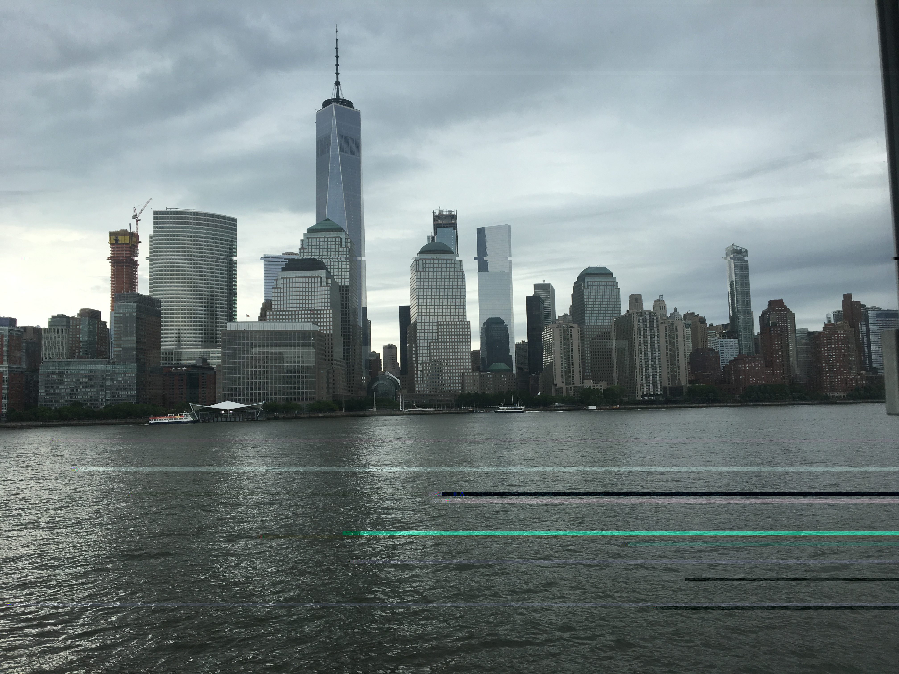

### **Image**



### **Input:**

```Describe in one paragraph what is in the image```

### **Response:**

```The image features a large city with many tall buildings, including skyscrapers. The skyline is dominated by the iconic New York City skyline, which includes the World Trade Center and other notable landmarks. The cityscape also includes boats on the water, adding to the bustling urban atmosphere.```

### **Input:**

```How many boats are on the water```

### **Response:**

```There are a couple of boats on the water in the image.```

### **Input:**

```Are there any people visible in the image```

### **Response:**

```No, there are no people visible in the image.```